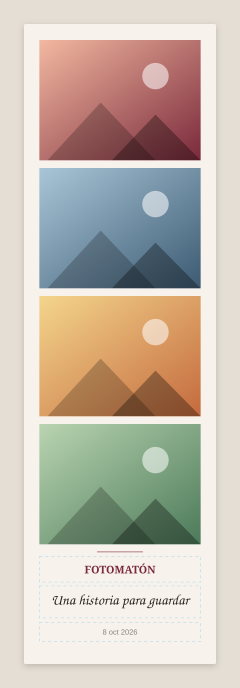
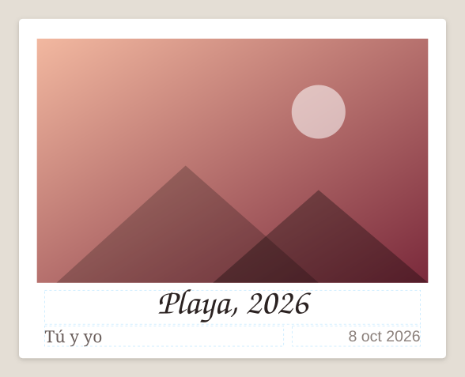
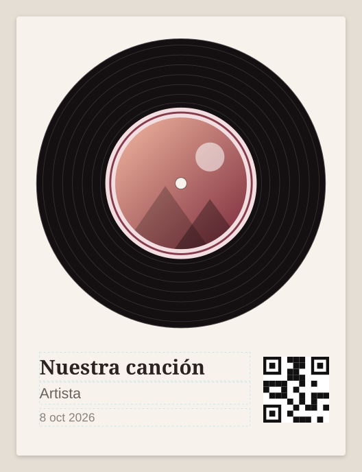
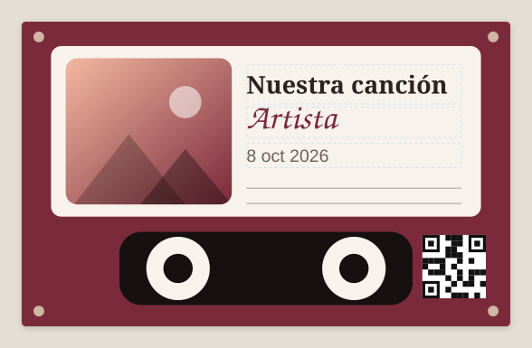
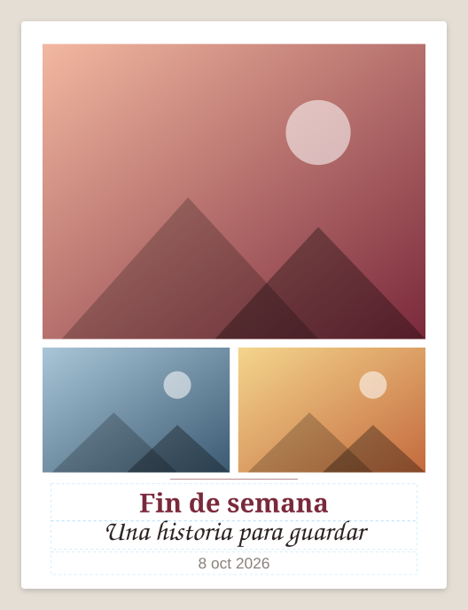
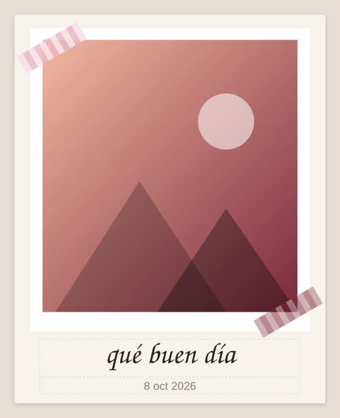

# Diseños de la fase 3 (subproyecto 3)

Fuente única de la geometría: `shared-fixtures/estilos-geometria.json`. Android y Mac la reproducen idéntica y la prueba de paridad la lee (tolerancia 0.5 pt). Las vistas previas se regeneran con `python3 tools/fixtures/render_svg.py` (los recuadros punteados azules son las zonas de texto; las fotos son marcadores de posición).

Convenciones del JSON:
- Toda `x, y, w, h` es fracción del ancho (x, w) y del alto (y, h) de la tarjeta. `cardAspect` = ancho / alto.
- `referenceCardWidthPt` = 180. Los tamaños de texto (`defaultSizePt`) están a ese ancho y se escalan por `anchoReal / 180`.
- `radius` (fotos y `roundRect`) = fracción del lado menor de la forma, medido en puntos. Un `ellipse` en un hueco cuadrado en puntos es un círculo.
- Decoraciones: primitivas `rect`, `roundRect`, `ellipse`, `ring` (sólo trazo, `strokeW` = fracción del ancho), `stripes` (`count` franjas verticales con huecos iguales). Se dibujan en el orden de la lista; `layer: below` antes de las fotos y `above` después. `rotationDeg` gira en sentido horario sobre el centro del rectángulo, ya en puntos.
- `qrSlot` (sólo música): esquina superior izquierda y lado como fracción del ancho; se dibuja únicamente si hay enlace.
- Fuentes por defecto: Gelasio (títulos), Caveat (manuscrito), `.System` (apoyo). Todas se pueden cambiar por tarjeta como en los demás diseños.
- Categorías: Fotomatón e Instantánea ancha en Clásicos; Vinilo y Casete en Música; Collage en Libre; Cinta washi en Ocasiones.

## Fotomatón (`photobooth`, 4 fotos, proporción 0.30)
Tira crema, estrecha y alta, con cuatro fotos apiladas del mismo tamaño (proporción 4:3), una línea fina vino y debajo título, pie manuscrito y fecha. Textos: Título, Pie de foto, Fecha.

## Instantánea ancha (`instaxWide`, 1 foto, proporción 1.256)
Marco blanco horizontal con las medidas de una película Instax Wide: foto de 99 × 62 mm dentro de una tarjeta de 108 × 86 mm, con el borde inferior más grueso. Título manuscrito centrado; subtítulo a la izquierda y fecha a la derecha. Textos: Título, Subtítulo, Fecha.

## Vinilo (`vinyl`, 1 foto, proporción 0.75)
Funda crema con un disco negro de surcos finos; la foto es un círculo que hace de etiqueta, con un anillo vino y un agujero central. Canción y artista abajo a la izquierda; el QR opcional va abajo a la derecha. Textos: Canción, Artista, Fecha. Foto de forma `ellipse` (círculo).

## Casete (`cassette`, 1 foto, proporción 1.6)
Cuerpo vino con tornillos en las esquinas, etiqueta crema con la foto a la izquierda (esquinas redondeadas) y texto a la derecha con dos líneas de escritura; ventana oscura con dos carretes. QR opcional a la derecha de la ventana. Textos: Canción, Artista (manuscrito), Fecha.

## Collage (`collage`, 3 fotos, proporción 0.75)
Una foto grande arriba y dos pequeñas debajo, separadas por un hueco de 3.6 pt, con título, pie manuscrito y fecha centrados. Textos: Título, Pie de foto, Fecha.

## Cinta washi (`washi`, 1 foto, proporción 0.8)
Papel crema con la foto sobre un marco blanco y dos tiras de cinta (rosa a rayas arriba a la izquierda, vino abajo a la derecha, mismo ángulo, simétricas respecto al centro del marco). Pie manuscrito grande y fecha. Textos: Pie de foto, Fecha.

## Fixtures de moldes v2 (tarea 6)
`shared-fixtures/moldes/`, generados con `python3 tools/fixtures/make_moldes.py` (sólo biblioteca estándar):

| Archivo | Contenido |
|---|---|
| `molde-rects.png` | 1200 × 1600, fondo vino, 3 huecos transparentes rectangulares; franja rosa y barra oscura opacas (no son huecos) |
| `molde-rounded.png` | Mismos huecos, redondeados con radio del 20 % del lado menor |
| `molde-circles.png` | Fondo crema, 3 huecos circulares |
| `molde-rects-50.png` | `molde-rects.png` reescalado al 50 % (600 × 800) |
| `molde-distinto-tira.png` | Plantilla distinta: tira de 4 huecos sobre fondo oscuro |
| `moldes.json` | Regiones esperadas (fracciones), forma, radio y valores dHash |

Relación esperada de dHash (distancia de Hamming): `rects` contra `rects-50` = 0 (duplicado, umbral ≤ 6); `rects` contra `distinto-tira` = 28 (distinto); `rects` contra `rounded` = 5 (parecido, el usuario decide). El algoritmo exacto está en `moldes.json`; una implementación con otro remuestreo puede diferir unos bits, por eso las pruebas deben comprobar el umbral y no igualdad exacta.
